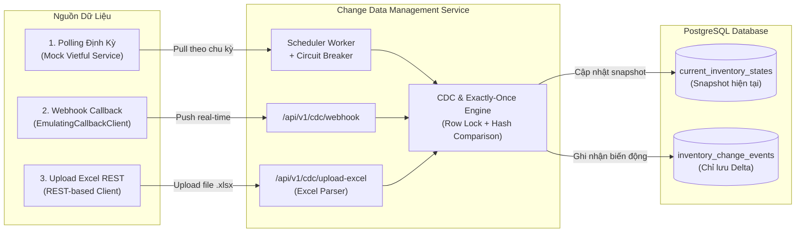

# Change Data Management Service (CDMS) Prototype

[]()
[]()
[]()
[]()

> **Dự án**: Change Data Management Service Prototype tại **kSynerX**  
> **Tác giả**: Lê Anh Quân  
> **Mục tiêu**: Phát triển hệ thống quản lý dữ liệu biến đổi (CDMS) chỉ lưu trữ các delta (thay đổi mới), tuân thủ nghiêm ngặt ngữ nghĩa **Exactly-Once**, hỗ trợ 3 cơ chế nạp dữ liệu và có khả năng chống chịu lỗi (Fault-Tolerance) dưới tải đột biến (Spike Load).

---

## 📑 Mục lục
1. [Tổng quan hệ thống](#1-tổng-quan-hệ-thống)
2. [Kiến trúc & 3 Cơ chế nạp dữ liệu](#2-kiến-trúc--3-cơ-chế-nạp-dữ-liệu)
3. [Cơ chế Exactly-Once & Lọc trùng/cũ](#3-cơ-chế-exactly-once--lọc-trùngcũ)
4. [Khả năng chịu lỗi (Resilience & Fault Tolerance)](#4-khả-năng-chịu-lỗi-resilience--fault-tolerance)
5. [Cấu trúc thư mục dự án](#5-cấu-trúc-thư-mục-dự-án)
6. [Hướng dẫn cài đặt & Khởi chạy](#6-hướng-dẫn-cài-đặt--khởi-chạy)
7. [Kịch bản kiểm thử & Demonstration](#7-kịch-bản-kiểm-thử--demonstration)
8. [Chạy Unit Test & Spike Load Test](#8-chạy-unit-test--spike-load-test)
9. [Báo cáo kết quả bài test (Assignment Outcomes)](#9-báo-cáo-kết-quả-bài-test-assignment-outcomes)

---

## 1. Tổng quan hệ thống

Trong các hệ thống quản lý kho vận (WMS) và chuỗi cung ứng (như Vietful), việc đồng bộ toàn bộ dữ liệu (Full Snapshot Dump) gây lãng phí băng thông, nghẽn tài nguyên cơ sở dữ liệu và khó truy vết lịch sử biến động kho.

**CDMS Prototype** giải quyết triệt để bài toán này bằng cách:
- **Chỉ lưu trữ biến đổi (Delta Only)**: Bảng `inventory_change_events` chỉ ghi nhận các bản ghi khi thực sự có thay đổi giá trị (số lượng tồn, trạng thái, mã đơn vị).
- **Lưu trữ trạng thái hiện hành (Current Snapshot)**: Bảng `current_inventory_states` duy trì ảnh chụp mới nhất kèm phiên bản (`version`) và chuỗi băm nội dung (`content_hash`).
- **Ngăn chặn trùng lặp và dữ liệu cũ**: Bất kỳ dữ liệu nào đến trễ (timestamp cũ hơn) hoặc dữ liệu trùng lặp (không đổi nội dung) đều bị loại bỏ ngay tại tầng xử lý.

---

## 2. Kiến trúc & 3 Cơ chế nạp dữ liệu

Hệ thống hỗ trợ đồng thời 3 cơ chế nạp dữ liệu độc lập:



1. **Scheduled Polling**: Module `scheduler.py` tự động gửi HTTP GET định kỳ đến endpoint `/api/v1/Products/inventories` của Vietful Mock. Tích hợp mô hình **Circuit Breaker** ngăn chặn sụp đổ dây chuyền khi Vietful gặp sự cố.
2. **Webhook Callbacks**: Endpoint `POST /api/v1/cdc/webhook` tiếp nhận sự kiện đẩy trực tiếp từ client bên ngoài (`EmulatingCallbackClient`), hỗ trợ `event_id` chống gửi lặp.
3. **Excel File Ingestion**: Endpoint `POST /api/v1/cdc/upload-excel` tiếp nhận bảng tính `.xlsx`, sử dụng `openpyxl`/`pandas` chuẩn hóa tên cột tiếng Việt/tiếng Anh và nạp biến động hàng loạt.

---

## 3. Cơ chế Exactly-Once & Lọc trùng/cũ

Quy trình xử lý tại `cdc_engine.py` bảo đảm tính toán vẹn dữ liệu:

1. **Chuẩn hóa & Băm nội dung (Content Hashing)**:
   - Các trường nghiệp vụ theo dõi (`physical_qty`, `available_qty`, `pending_in_qty`, `pending_out_qty`, `freeze_qty`, `in_transit_qty`, `is_active`, `unit_code`, `condition_type_code`) được chuẩn hóa và tính băm SHA-256.
2. **Khóa bản ghi mức dòng (Pessimistic Row Lock)**:
   - Mở Transaction và thực hiện `SELECT ... FOR UPDATE` trên khóa `(warehouse_code, partner_sku)` để ngăn chặn tình trạng Race Condition khi nhiều kênh cùng cập nhật 1 sản phẩm.
3. **Kiểm tra dữ liệu cũ (Stale Out-of-Order Check)**:
   - Nếu `incoming_timestamp < current_snapshot.last_event_timestamp`: Bỏ qua với trạng thái `IGNORED_OUTDATED`. Không cho phép dữ liệu cũ ghi đè dữ liệu mới.
4. **Kiểm tra trùng lặp (Duplicate Check)**:
   - Nếu `incoming_hash == current_snapshot.content_hash`: Bỏ qua với trạng thái `IGNORED_DUPLICATE`. Không sinh bản ghi delta dư thừa.
5. **Ghi nhận Delta (Granular Diff)**:
   - Tính toán chi tiết sai khác từng trường: `{"physical_qty": {"old": 100, "new": 120}}`.
   - Tăng `version = version + 1`.
   - Ghi vào bảng `inventory_change_events` và cập nhật `current_inventory_states`.

---

## 4. Khả năng chịu lỗi (Resilience & Fault Tolerance)

| Sự cố | Ảnh hưởng | Giải pháp xử lý trong CDMS | Kết quả |
| :--- | :--- | :--- | :--- |
| **Vietful Service Down** | Polling định kỳ thất bại, lỗi kết nối | Tích hợp **Circuit Breaker** (`CLOSED` ➔ `OPEN` sau 3 lần lỗi, tạm dừng 20s, chuyển `HALF_OPEN` thăm dò). | CDMS không bị sập hay treo, tự phục hồi khi Vietful hoạt động trở lại. |
| **Database Disconnect** | Không ghi được dữ liệu | SQLAlchemy `pool_pre_ping=True`, cơ chế Retry kết nối, Rollback transaction tự động, trả về HTTP 503 để client retry. | Không làm hỏng dữ liệu, client có thể gửi lại an toàn. |
| **CDMS Crash / Reboot** | Tiến trình tắt đột ngột | Toàn bộ trạng thái và delta đều được bảo vệ trong PostgreSQL ACID. | Khởi động lại nhận diện schema tự động và tiếp tục polling bình thường. |
| **Spike Load Concurrency** | Hàng trăm request cùng lúc | Row-level locking + Idempotency Table + cơ chế tự giải quyết xung đột `IntegrityError`. | Không bị deadlock, không sinh trùng version, 100% đúng dữ liệu. |

---

## 5. Cấu trúc thư mục dự án

```text
ksynerx-cdms-prototype/
├── docker-compose.yml              # Khởi chạy toàn bộ hệ thống (PostgreSQL + Services)
├── README.md                       # Tài liệu hướng dẫn chi tiết
├── docs/                           # Tài liệu thiết kế & phân tích
│   ├── architecture.md             # Sơ đồ kiến trúc, luồng dữ liệu & ERD
│   └── lessons_learned.md          # Bài học kinh nghiệm & giải trình
├── mock_vietful/                   # 1. Emulating Vietful Inventory Service
│   ├── Dockerfile                  # Container đa tầng non-root
│   ├── requirements.txt            # Thư viện: FastAPI, Faker, Uvicorn
│   └── app/
│       ├── main.py                 # API mock theo chuẩn Vietful Swagger
│       └── data_generator.py       # Faker sinh dữ liệu kho hàng thực tế
├── cdms_service/                   # 2. Change Data Management Service (Service chính)
│   ├── Dockerfile                  # Container đa tầng non-root
│   ├── requirements.txt            # Thư viện: FastAPI, SQLAlchemy, Pandas, ...
│   ├── app/
│   │   ├── main.py                 # FastAPI Application & Lifespan
│   │   ├── config.py               # Cấu hình môi trường & tham số
│   │   ├── database.py             # Kết nối PostgreSQL / SQLite
│   │   ├── models.py               # ORM Entities & Pydantic DTOs
│   │   ├── api/
│   │   │   ├── webhook.py          # API nhận Webhook CDC & tra cứu
│   │   │   └── upload_excel.py     # API Upload file Excel
│   │   └── services/
│   │       ├── scheduler.py        # Polling định kỳ + Circuit Breaker
│   │       ├── cdc_engine.py       # Lõi lọc trùng, lọc cũ & Exactly-once
│   │       └── excel_parser.py     # Parser đọc bảng tính .xlsx
│   └── tests/                      # Bộ kiểm thử Unit & Concurrency
│       ├── test_exactly_once.py    # Kiểm tra ngữ nghĩa Exactly-Once
│       ├── test_spike_load.py      # Kiểm tra tải đột biến đa luồng
│       ├── test_circuit_breaker.py # Kiểm tra Circuit Breaker chịu lỗi
│       ├── test_excel_parser.py    # Kiểm tra parser Excel
│       └── test_api_endpoints.py   # Kiểm tra toàn bộ REST API
└── clients_emulator/               # 3. Client giả lập tương tác
    ├── emulating_callback_client.py # Client giả lập đẩy Webhook CDC
    └── rest_excel_client.py         # Client giả lập upload file Excel
```

---

## 6. Hướng dẫn cài đặt & Khởi chạy

### Cách 1: Khởi chạy bằng Docker Compose (Khuyên dùng)

Yêu cầu: Docker Desktop đã bật.

```bash
# 1. Di chuyển vào thư mục dự án
cd ksynerx-cdms-prototype

# 2. Khởi chạy toàn bộ hệ thống (Postgres, Mock Vietful, CDMS)
docker compose up --build -d

# 3. Xem logs hoạt động
docker compose logs -f
```

Kiểm tra trạng thái các dịch vụ:
- **CDMS API & Docs**: http://localhost:8000/docs
- **Mock Vietful API**: http://localhost:8001/docs
- **CDMS Healthcheck**: http://localhost:8000/health
- **CDMS Prometheus Metrics**: http://localhost:8000/metrics

---

### Cách 2: Khởi chạy môi trường Local Python (Không cần Docker)

```bash
# 1. Cài đặt các thư viện cần thiết
pip install -r cdms_service/requirements.txt
pip install -r mock_vietful/requirements.txt

# 2. Chạy Mock Vietful Service (Terminal 1 - Port 8001)
python -m uvicorn mock_vietful.app.main:app --port 8001

# 3. Chạy CDMS Service (Terminal 2 - Port 8000, dùng SQLite local)
set DATABASE_URL=sqlite:///./cdms.db
set VIETFUL_API_BASE_URL=http://localhost:8001
python -m uvicorn cdms_service.app.main:app --port 8000
```

---

## 7. Kịch bản kiểm thử & Demonstration

### 🚀 Khởi chạy tự động toàn bộ kịch bản bằng 1 lệnh:
```bash
python run_demo.py
```
*(Script sẽ tự động chạy qua 7 bước: Healthcheck -> INSERT -> Exactly-Once Deduplication -> Stale Rejection -> Soft DELETE -> Catalog Reconciliation -> Prometheus Metrics).*

---

### Hoặc chạy từng kịch bản thủ công:

### Kịch bản 1: Gửi Webhook bình thường (Tạo mới sản phẩm)
```bash
python clients_emulator/emulating_callback_client.py --scenario normal
```
*Kết quả*: CDMS ghi nhận 3 bản ghi mới (`change_type = 'INSERT'`).

### Kịch bản 2: Gửi trùng lặp (Thử nghiệm Exactly-Once)
```bash
python clients_emulator/emulating_callback_client.py --scenario duplicate
```
*Kết quả*: Lần 1 ghi nhận 1 bản ghi mới. Lần 2 gửi y hệt ➔ `ignored_duplicates = 1`, không sinh thêm bản ghi delta nào trong DB.

### Kịch bản 3: Gửi sự kiện đến trễ / Dữ liệu cũ (Outdated Event)
```bash
python clients_emulator/emulating_callback_client.py --scenario outdated
```
*Kết quả*: Bản ghi mới (timestamp hiện tại) được lưu trữ. Bản ghi cũ (timestamp 2 giờ trước) bị từ chối ➔ `ignored_outdated = 1`.

### Kịch bản 4: Upload file Excel mẫu
```bash
# Tạo file và upload lần đầu
python clients_emulator/rest_excel_client.py --save sample_stock.xlsx --test-dedup
```
*Kết quả*: Lần 1 nạp dữ liệu thành công. Lần 2 upload lại chính file đó ➔ `ignored_duplicates = 2`, `recorded_changes = 0`.

### Kịch bản 5: Mô phỏng thay đổi dữ liệu tại Vietful và chờ Poller nạp
```bash
# Gọi Mock Vietful tạo thay đổi ngẫu nhiên
curl -X POST http://localhost:8001/api/v1/Products/simulate-change?count=3
```
*Kết quả*: Sau 15 giây (chu kỳ scheduler), poller của CDMS tự động phát hiện delta và ghi vào DB.

### Tra cứu biến động đã ghi nhận:
```bash
# Xem danh sách các delta vừa ghi nhận
curl -s http://localhost:8000/api/v1/cdc/events | python -m json.tool

# Xem trạng thái ảnh chụp hiện tại
curl -s http://localhost:8000/api/v1/cdc/states | python -m json.tool
```

---

## 8. Chạy Unit Test & Spike Load Test
 
Hệ thống đi kèm bộ kiểm thử tự động toàn diện với **43 test cases** (bao gồm bảo mật HMAC có Anti-Replay Timestamp, Rate Limiting với cơ chế tự giải phóng bộ nhớ, Excel hardening với phòng chống Formula Injection, Intra-batch SKU Exactly-Once với session flush, Soft Delete & Warehouse Reconciliation, Prometheus Metrics, và Concurrency Spike Load thật):

```bash
# Chạy toàn bộ Unit Tests, Security Tests và Spike Load Tests
python -m pytest cdms_service/tests/ -v

# Chạy kèm báo cáo độ bao phủ mã nguồn (Coverage Report)
python -m pytest cdms_service/tests/ --cov=cdms_service/app --cov-report=term-missing
```

Kết quả: **100% Test PASS (43/43)**, Coverage toàn hệ thống đạt **87% - 100%** trên các module lõi.

---

## 9. Báo cáo kết quả bài test (Assignment Outcomes)

Theo đúng yêu cầu của đề bài tại file `FullStack_BàiTest.pdf`:

### 9.1. Trình bày và giải thích Prototype
- Đã hoàn thiện prototype chạy thực tế gồm 3 thành phần độc lập (`mock_vietful`, `cdms_service`, `clients_emulator`) kết nối qua PostgreSQL.
- Đáp ứng đầy đủ 3 cơ chế: Polling định kỳ (hỗ trợ phân trang & incremental watermark `FromDate`), Webhook real-time (hỗ trợ HMAC/API-Key, Anti-Replay `X-CDMS-Timestamp` & batch idempotency), và Upload file Excel (hỗ trợ magic bytes, size validation, và chống Formula Injection).
- Đảm bảo tính toàn vẹn Exactly-Once, lọc trùng lặp và loại bỏ dữ liệu cũ bằng thuật toán băm SHA-256 kết hợp khóa dòng, session flush từng item, và vòng lặp tự giải quyết xung đột `SQLAlchemyError`.

### 9.2. Bài học kinh nghiệm (Lessons Learned)
- Xem chi tiết tại [docs/lessons_learned.md](docs/lessons_learned.md).
- Điểm mấu chốt: Trong hệ thống phân tán, Exactly-Once thực chất là sự kết hợp của **At-Least-Once Delivery + Idempotent Processing**.
- Khi một webhook hoặc file Excel gửi nhiều item cho cùng một SKU trong cùng một batch: cần gọi `self.db.flush()` ngay sau khi ghi nhận mỗi thay đổi. Nhờ đó, item tiếp theo trong cùng transaction sẽ nhận diện được snapshot vừa tạo/sửa thay vì cố tạo mới gây xung đột khóa `IntegrityError`.
- Khi một webhook gửi nhiều item trong cùng 1 batch kèm `event_id`, việc phân biệt Batch Idempotency (`processed_events_idempotency`) và Item Event ID (`f"{client_event_id}#{wh}#{sku_key}#v{version}"`) là tối quan trọng để tránh xung đột khóa Unique.
- Việc khóa dòng theo khóa nghiệp vụ `(warehouse_code, partner_sku)` kết hợp vòng lặp retry có expunge/rollback giúp hệ thống tự phục hồi dưới tải đột biến mà không bị treo.

### 9.3. Danh mục tính năng đã thực hiện vs Hướng phát triển
- **Đã hoàn thiện 100%**:
  - Emulating Vietful Inventory Service theo chuẩn OpenAPI của Vietful (hỗ trợ filter `FromDate`).
  - 3 cơ chế nạp dữ liệu: Scheduled Polling (Full Pagination + Watermark), Webhook CDC, REST Excel.
  - Xử lý lỗi: Circuit Breaker cho Vietful, Multi-attempt Retry cho Database Concurrency, Reboot recovery cho CDMS.
  - Bảo mật doanh nghiệp: HMAC-SHA256 signature verification, Anti-Replay window check (`X-CDMS-Timestamp`), API Key / Bearer Auth, Memory-bounded Sliding Window Rate Limiting, Excel Magic Bytes/Size limits & Formula Injection sanitization, CORS whitelist.
  - Kiểm thử đa luồng dưới tải đột biến thật (True Concurrency Spike Load không dùng artificial mutex).
  - Đóng gói Docker đa tầng bảo mật (Non-root user, tini, healthchecks, bind host an toàn `127.0.0.1:5432`).
- **Xem xét mở rộng trong tương lai**:
  - Tích hợp Message Broker (Kafka / RabbitMQ) để đệm hàng đợi sự kiện trước khi ghi DB khi scale ra hệ thống phân tán đa máy.
  - Phân tầng bộ nhớ đệm Redis để deduplicate trước khi chạm vào cơ sở dữ liệu.

### 9.4. Báo cáo minh bạch về việc sử dụng AI (AI Disclosure)
- **Ứng viên**: Lên ý tưởng kiến trúc tổng thể, mô hình hóa dữ liệu (Data Modeling), thiết kế giải thuật Exactly-Once, phân tích và vá lỗi xung đột khóa Batch, thiết kế kiến trúc bảo mật nhiều lớp (HMAC, Rate Limiter, Magic Bytes), kiểm thử tải đột biến.
- **AI Tool (Antigravity / Gemini)**: Hỗ trợ sinh mã nguồn tuân thủ quy chuẩn thiết kế module hóa (< 250 dòng/file), ánh xạ nhanh các DTO theo Swagger của Vietful, tạo dữ liệu giả lập bằng Faker, sinh các sơ đồ kiến trúc Mermaid và bổ sung bộ test tự động.
