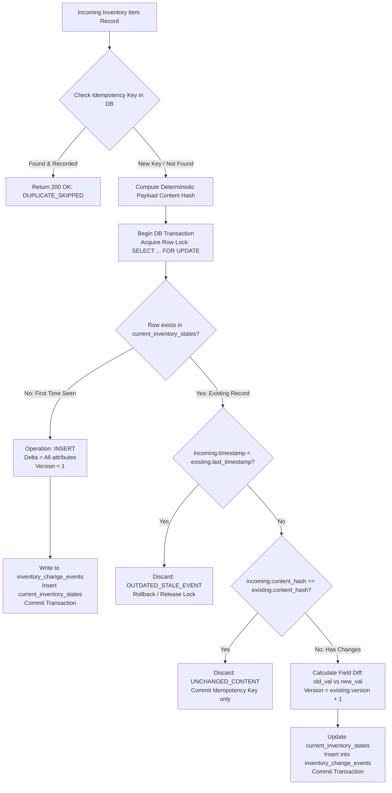

# System Architecture Specification: Change Data Management Service (CDMS)

## 1. Overview & Objectives

The **Change Data Management Service (CDMS)** is an event-driven and scheduled data integration prototype designed to track, detect, and store **only data changes (deltas)** of inventory products from an emulated warehouse management system (**Vietful Inventory Service**).

### Core Goals:
1. **Three Ingestion Vectors**:
   - **Pre-defined Scheduled Polling**: Periodic pull queries against Vietful API.
   - **Real-Time CDC Webhook**: Push events delivered by `EmulatingCallbackClient`.
   - **REST Batch File Ingestion**: Excel (`.xlsx`) spreadsheets uploaded by `REST-based Client`.
2. **Strict Exactly-Once Semantic**:
   - Discards identical duplicate updates (no redundant change rows).
   - Rejects out-of-order stale data (older timestamps arriving after newer updates).
   - Persists only genuine deltas (`INSERT`, `UPDATE`, `DELETE`) with field-level diffs.
3. **Resilience & Fault Tolerance**:
   - Survives transient outages of Vietful, database disconnections, and CDMS process restarts.
4. **Concurrency & Spike Load Safety**:
   - Handles high-concurrency bursts across all three vectors without race conditions or duplicated version numbers.

---

## 2. High-Level Architecture Diagram

```mermaid
flowchart TD
    subgraph External_Clients["Clients & Sources"]
        VC[EmulatingCallbackClient]
        EC[REST-based Excel Client]
        VIS[Emulating Vietful Service\n(FastAPI + Faker)]
    end

    subgraph CDMS["Change Data Management Service (CDMS)"]
        subgraph API_Layer["Ingestion API Endpoints"]
            WH["/api/v1/cdc/webhook"]
            UP["/api/v1/cdc/upload-excel"]
            ST["/api/v1/cdc/states & /events"]
        end

        subgraph Ingestion_Engines["Ingestion Processors"]
            SCH["Scheduler Worker\n(Periodic Poller + Circuit Breaker)"]
            EP["Excel Parser Engine\n(OpenPyXL/Pandas)"]
        end

        subgraph Core_Engine["Core CDC Engine"]
            IDEM["Idempotency & Hash Validator"]
            LOCK["Transaction & Row Lock Manager"]
            DIFF["Delta Calculator\n(Field-Level Diff)"]
        end
    end

    subgraph Database["PostgreSQL Storage"]
        CURR[("current_inventory_states\n(Latest Snapshot)")]
        LOGS[("inventory_change_events\n(Delta Log Only)")]
        IDEM_LOG[("processed_events_idempotency\n(Fast-path Deduplication)")]
    end

    %% Flow connections
    VC -->|POST JSON Webhook| WH
    EC -->|POST .xlsx file| UP
    SCH -->|GET /api/v1/Products/inventories| VIS

    WH --> IDEM
    UP --> EP
    EP --> IDEM
    SCH --> IDEM

    IDEM --> LOCK
    LOCK --> DIFF

    DIFF -->|Update State| CURR
    DIFF -->|Insert Delta Only| LOGS
    DIFF -->|Mark Processed| IDEM_LOG

    ST -->|Read Queries| CURR
    ST -->|Read History| LOGS
```

---

## 3. Data Ingestion Vectors

| Mechanism | Trigger | Target Endpoint / Method | Failure Handling |
| :--- | :--- | :--- | :--- |
| **Scheduled Polling** | Configurable Cron / Interval (default: 30s) | `GET /api/v1/Products/inventories` on Vietful | Exponential backoff, Circuit Breaker (`OPEN`/`HALF-OPEN`/`CLOSED`), non-blocking background task. |
| **Webhook Callbacks** | Event-driven (e.g. inventory shift) | `POST /api/v1/cdc/webhook` | Idempotency key deduplication, 200 OK for duplicates without writing redundant DB rows. |
| **Excel File Upload** | Ad-hoc REST upload | `POST /api/v1/cdc/upload-excel` | Streaming chunk validation, batch transactional delta processing, row-level error reporting. |

---

## 4. Exactly-Once & Anti-Duplication Algorithm



---

## 5. Database Schema (PostgreSQL)

### 5.1. `current_inventory_states`
Maintains the latest validated snapshot for each inventory unit.

| Column | Type | Constraints | Description |
| :--- | :--- | :--- | :--- |
| `warehouse_code` | VARCHAR(64) | PK | Warehouse identifier (e.g. `WH-HN-01`) |
| `partner_sku` | VARCHAR(128) | PK | Business product identifier (e.g. `SKU-IPHONE15`) |
| `sku` | VARCHAR(128) | NOT NULL | Internal barcode/SKU |
| `product_name` | VARCHAR(255) | NULL | Product descriptive name |
| `unit_code` | VARCHAR(32) | NOT NULL | Unit of measure (e.g. `CAI`, `HOP`) |
| `condition_type_code`| VARCHAR(32) | NOT NULL | Condition code (`NEW`, `GOOD`, `REFURBISHED`) |
| `physical_qty` | INTEGER | NOT NULL | Total physical quantity |
| `available_qty` | INTEGER | NOT NULL | Available stock for orders |
| `pending_in_qty` | INTEGER | NOT NULL | Stock incoming/inbound |
| `pending_out_qty` | INTEGER | NOT NULL | Stock reserved/outbound |
| `freeze_qty` | INTEGER | NOT NULL | Frozen/blocked stock |
| `in_transit_qty` | INTEGER | NOT NULL | Stock moving between hubs |
| `is_active` | BOOLEAN | NOT NULL | Operational status |
| `content_hash` | VARCHAR(64) | NOT NULL | SHA-256 of normalized tracked fields |
| `version` | INTEGER | NOT NULL | Incremental sequence number |
| `last_event_timestamp`| TIMESTAMPTZ | NOT NULL | Source timestamp of the latest change |
| `updated_at` | TIMESTAMPTZ | NOT NULL | CDMS local processing timestamp |

### 5.2. `inventory_change_events`
Stores **only genuine deltas**. No duplicates or static states.

| Column | Type | Constraints | Description |
| :--- | :--- | :--- | :--- |
| `id` | BIGSERIAL | PK | Global auto-increment event ID |
| `event_id` | VARCHAR(128) | UNIQUE, NOT NULL | Deterministic idempotency UUID or hash |
| `warehouse_code` | VARCHAR(64) | NOT NULL | Warehouse identifier |
| `partner_sku` | VARCHAR(128) | NOT NULL | Product SKU |
| `sku` | VARCHAR(128) | NOT NULL | Barcode SKU |
| `change_type` | VARCHAR(16) | NOT NULL | `INSERT`, `UPDATE`, or `DELETE` |
| `source` | VARCHAR(32) | NOT NULL | `SCHEDULER_POLL`, `WEBHOOK_CDC`, `EXCEL_UPLOAD` |
| `source_timestamp` | TIMESTAMPTZ | NOT NULL | Source event generation timestamp |
| `detected_at` | TIMESTAMPTZ | NOT NULL | Timestamp when change was ingested by CDMS |
| `old_state` | JSONB | NULL | Previous state of changed fields |
| `new_state` | JSONB | NOT NULL | New state of changed fields |
| `diff` | JSONB | NOT NULL | Granular delta: `{"field": {"old": x, "new": y}}` |
| `content_hash` | VARCHAR(64) | NOT NULL | New content SHA-256 |
| `version` | INTEGER | NOT NULL | Version snapshot sequence |

### 5.3. `processed_events_idempotency`
Fast-path lookup table to track received client-provided or computed idempotency keys.

---

## 6. Fault-Tolerance & Resilience Matrix

| Failure Mode | Impact | Detection & Mitigation | Recovery Strategy |
| :--- | :--- | :--- | :--- |
| **Vietful Outage (HTTP 5xx / Timeout)** | Polling queries fail | Caught by `CircuitBreaker`. State transitions to `OPEN`, polling paused for backoff duration. | Circuit switches to `HALF-OPEN` to test probe request. Once healthy, transitions back to `CLOSED`. |
| **PostgreSQL Outage / Network Cut** | Ingestion writes fail | SQLAlchemy `pool_pre_ping=True`, retry loop with exponential backoff on connection error. | Uncommitted transactions automatically roll back. Endpoints return HTTP 503 (`Service Unavailable`) to allow clients to retry safely. |
| **CDMS Crash / Hard Reboot** | Active memory lost | All states and deltas are stored durably in PostgreSQL with ACID guarantees. | On reboot, CDMS reads latest DB states, initializes background scheduler automatically, and resumes. |
| **Spike Ingestion Load** | High concurrency | Row-level locking (`SELECT ... FOR UPDATE`) prevents version collision and duplicate insertions. | Fast-path idempotency caching in DB rejects duplicate webhooks in milliseconds. |
